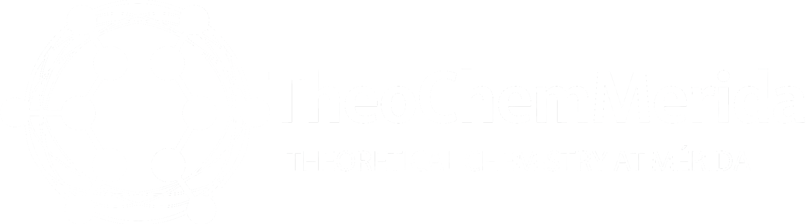

<h1 align="center">
  
</h1>

<h1 align="center">TheoChemMérida — Official Research Group Website</h1>

<p align="center">
  <strong>Theoretical & Computational Chemistry · CINVESTAV Mérida</strong><br/>
  Mérida, Yucatán, México
</p>

<p align="center">
  <a href="https://theochemmerida.com">
    
  </a>
  
  
  
  
  
</p>

---

## Overview

Official website of **TheoChemMérida**, the theoretical and computational chemistry research group at [CINVESTAV Mérida](https://www.mda.cinvestav.mx/), led by **Dr. Gabriel Merino** and **Dr. Filiberto Ortiz Chi**. The site showcases the group's research areas, members, publications, software tools, events, and more.

The platform is built as a modern single-page application (SPA) with React 19 + TypeScript, featuring a BibTeX-powered publications engine, interactive member profiles, a 3D gallery, and dark/light theme support.

---

## Features

- **Research areas showcase** — Aromaticity, boron clusters, computational chemistry, automated workflows, materials, and chemistry under extreme conditions
- **Interactive member profiles** — Individual pages for current and alumni members with photo galleries and research highlights
- **Publications engine** — BibTeX-based bibliography parsed at runtime with year-based navigation and journal grouping
- **Software projects** — Gallery of open-source tools developed by the group (SmilX, eyringpy, SOLIDS, ELAYA SMILES)
- **Events timeline** — Past and upcoming conferences, workshops, and academic events
- **Photo gallery** — 3D-animated gallery of group activities
- **Contact page** — Direct inquiry form for prospective students and collaborators
- **Dark / Light mode** — System-aware theming via `next-themes`
- **Responsive UI** — Mobile-first design built with TailwindCSS 4 + shadcn/ui + Radix UI

---

## Tech Stack

| Tech | Purpose |
|------|---------|
| React 19 + TypeScript | Core UI framework |
| Vite 7 | Build tool & dev server |
| TailwindCSS 4 | Utility-first styling |
| shadcn/ui + Radix UI | Accessible component library |
| React Router 7 | Client-side routing |
| Motion (Framer Motion) | Animations & transitions |
| Embla Carousel | Image carousels |
| React Hook Form + Zod | Form handling & validation |
| citation-js | BibTeX parsing for publications |
| React Photo View | Lightbox image viewer |
| TanStack Virtual | Virtualized list rendering |
| next-themes | Dark/light mode theming |
| Lucide React + HugeIcons | Icon libraries |
| Recharts | Data visualization |
| Axios | HTTP client |
| vite-plugin-sitemap | Automatic sitemap generation |

---

## Project Structure

```
TheoChemMerida/
├── public/                      # Static assets & favicon
└── src/
    ├── assets/                  # Images, logos, member photos
    │   ├── areas/               # Research area visuals
    │   ├── events/              # Event banners
    │   ├── members/             # Member profile photos & galleries
    │   └── journals/            # Journal logos
    ├── components/              # Shared UI components
    │   ├── ui/                  # shadcn/ui primitives
    │   ├── 3d-gallery.tsx       # 3D animated photo gallery
    │   ├── header.tsx           # Site navigation
    │   ├── footer.tsx           # Site footer
    │   └── paper-section.tsx    # Publication card component
    ├── data/                    # Static structured data
    │   ├── people.ts            # Group members & alumni
    │   ├── research-areas.ts    # Research area definitions
    │   ├── projects.ts          # Software project entries
    │   ├── events.ts            # Conference & event entries
    │   └── merino.bib           # BibTeX publications database
    ├── pages/                   # Route-level page components
    │   ├── page.tsx             # Home / landing page
    │   ├── hero-section.tsx     # Hero banner
    │   ├── people/              # Group members listing & profiles
    │   ├── publications/        # Publications browser
    │   ├── software/            # Software showcase
    │   ├── events/              # Events listing
    │   ├── gallery/             # Photo gallery
    │   ├── contact/             # Contact form
    │   └── not-found/           # 404 page
    ├── hooks/                   # Custom React hooks
    ├── lib/                     # Utilities (BibTeX parser, routing, helpers)
    ├── contexts/                # React context providers
    └── routes/                  # Route definitions
```

---

## Getting Started

### Prerequisites

- Node.js 18+
- pnpm (recommended) or npm

### Installation

```bash
# Clone the repository
git clone https://github.com/TheoChemMerida/TheoChemMerida.git
cd TheoChemMerida

# Install dependencies
pnpm install        # or: npm install

# Start the development server
pnpm dev            # or: npm run dev
```

The site will be available at `http://localhost:5173`.

### Available Scripts

```bash
pnpm dev          # Start development server
pnpm build        # Type-check & build for production
pnpm preview      # Preview production build locally
pnpm lint         # Run ESLint
pnpm typecheck    # Run TypeScript type-checker
pnpm format       # Format code with Prettier
```

---

## Adding Content

### New member
Edit `src/data/people.ts` and add the member's photo to `src/assets/members/`.

### New publication
Add the BibTeX entry to `src/data/merino.bib`. The publications page parses and renders it automatically.

### New software project
Edit `src/data/projects.ts` and add a banner image to `src/assets/`.

### New event
Edit `src/data/events.ts` and add an event banner to `src/assets/events/`.

---

## Research Areas

| Area | Description |
|------|-------------|
| Aromaticity | Electron delocalization and unconventional bonding in molecular systems |
| Computational & Theoretical Chemistry | Quantum chemical modeling of molecular structure, stability, and reactivity |
| Boron Clusters | Boron-containing compounds and activation of small molecules |
| Automated Workflows | Data-driven approaches and automated computational pipelines |
| Materials & Molecular Systems | Organometallic complexes and functional molecular systems |
| Chemistry Under Extreme Conditions | Molecular behavior under high pressure and extreme physical conditions |

---

## Software Tools

| Tool | Description | Link |
|------|-------------|------|
| **SmilX** | Chemical space explorer for SMILES isomers | [smilx-isogenerator.streamlit.app](https://smilx-isogenerator.streamlit.app/) |
| **eyringpy** | Rate constant computation with tunneling corrections | [eyringpy.streamlit.app](https://eyringpy.streamlit.app/) |
| **SOLIDS** | Crystal structure prediction with ASE + PyXtal | [Users Guide](https://gabrielavidales.github.io/Solids-1.0-Users-Guide/#) |
| **ELAYA SMILES** | SMILES-to-3D structure web converter | [elaya-smiles.onrender.com](https://elaya-smiles.onrender.com/) |

---

## Webmaster Team

| Role | Name | GitHub |
|------|------|--------|
| Lead Developer | Eduardo Escalante Pacheco | [@edescal](https://github.com/edescal) |
| Webmaster | Gerardo Hernández Juárez | — |
| Webmaster Lead | Gabriela Vidales Ayala | [@GabrielaVidales](https://github.com/GabrielaVidales) |

---

## About TheoChemMérida

**TheoChemMérida** is the theoretical and computational chemistry research group of the Applied Physics Department at [CINVESTAV Mérida](https://www.mda.cinvestav.mx/), led by Dr. Gabriel Merino and Dr. Filiberto Ortiz Chi. The group uses modern computational chemistry tools to understand and predict the properties of novel organic and inorganic molecular systems.

Research interests include planar hypercoordinate carbon molecules, systems with multiple bonds, endohedral complexes, dimetallocenes, complex materials, and molecules under extreme conditions such as high pressure. A central objective is gaining fundamental insight into the structure, bonding, and electron delocalization of these systems.

The group also hosts **WATOC 2028**, the triennial congress of the [World Association of Theoretical and Computational Chemists](https://www.watoc.net/), to be held in Mérida, Yucatán, México. 🌐 [watoc2028.org](https://watoc2028.org)

---

## License

MIT © TheoChemMérida — CINVESTAV Mérida
